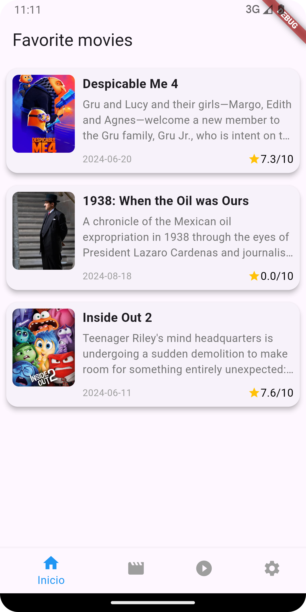
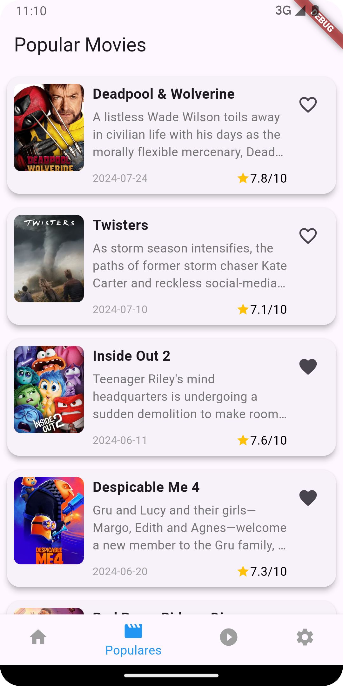
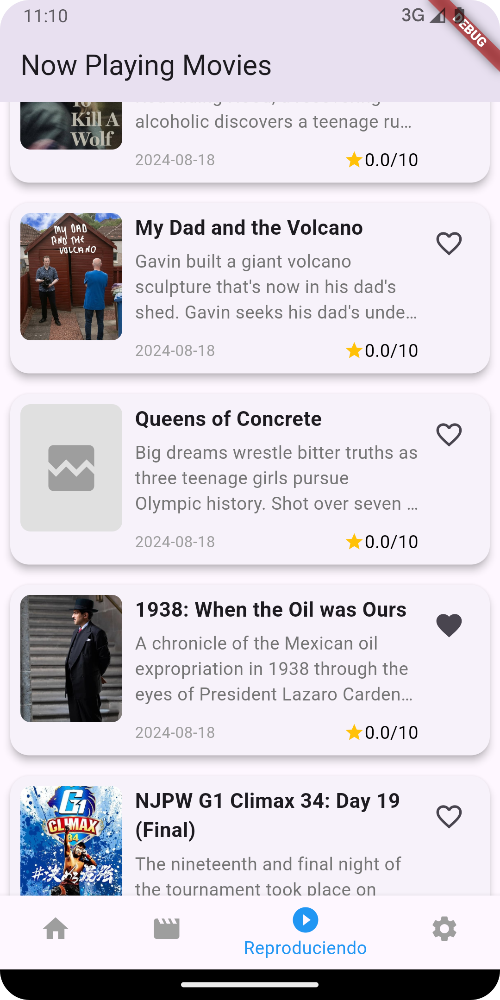
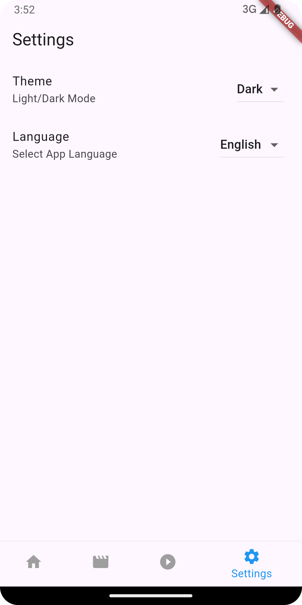
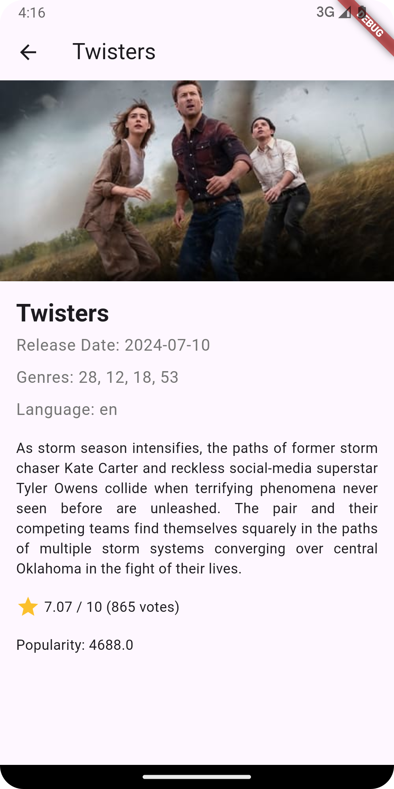
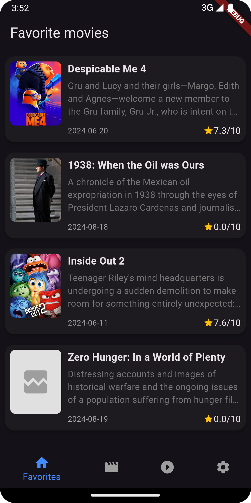

# Flutter Movies TMDB


## Table of Contents

- [Overview](#overview)
- [Features](#features)
- [Screenshots](#screenshots)
- [Getting Started](#getting-started)
- [Prerequisites](#prerequisites)
- [Installation](#installation)
- [Running the App](#running-the-app)
- [Architecture](#architecture)
- [Testing](#testing)
- [Contributing](#contributing)
- [Contact](#contact)

## Overview

**Flutter Movie TMDB** This project is a Flutter application that consumes services from The Movie Database (TMDb). The app is designed to display various movie categories, including popular movies, now playing, and user-selected favorites. Additionally, it allows users to view detailed information for each movie.

The app also includes a basic settings feature that enables users to switch between light and dark themes and change the interface language, providing a personalized and adaptable user experience.

## Features

- **Feature favorites**: The Favorites feature allows users to save their favorite movies for easy access. Favorite movies are stored locally using SQLite, ensuring that users can view their saved movies even when offline. This feature provides a convenient way to manage and revisit preferred content.

- **Feature popular movies**: The Popular Movies feature fetches the most popular movies from The Movie Database (TMDb). To ensure a seamless user experience even when offline, the fetched data is cached locally using SQLite. This caching mechanism allows users to browse popular movies without an internet connection, providing reliable access to content at any time.

- **Feature now playing movies**: The Now Playing Movies feature retrieves currently playing movies from The Movie Database (TMDb). To provide offline access and improve performance, the data is cached locally using SQLite. This allows users to view the latest movies playing in theaters even when they are not connected to the internet.

- **Feature movie detail**: The Movie Detail feature operates entirely offline, providing comprehensive information about a selected movie. It displays detailed data such as the movie's title, synopsis, release date, cast, and more, without requiring an internet connection. This feature ensures that users have access to in-depth movie details at any time, even when offline.

- **Feature settings**: The Settings feature allows users to change the language and theme of the application at runtime. Users can switch between different languages and toggle between light and dark themes according to their preferences. These changes are applied immediately and persist across sessions, enhancing the overall user experience and customization options.
  
## Screenshots

<p>






</p>

## Getting Started

### Prerequisites

- [Flutter SDK](https://flutter.dev/docs/get-started/install) (v3.5.0)
- [Dart](https://dart.dev/get-dart) (v3.5.0)
- An IDE with Flutter support (VS Code, Android Studio, etc.)

### Installation

1. Clone the repository:
```bash
git clone https://github.com/jcardenas-dev/flutter_movies.git
cd flutter_movies
```
2.  Install dependencies:
```bash
flutter pub get
```
3.  Create a  `.env`  file in the root of your project with the example content:
```bash
API_KEY='your_api_key'
BASE_URL=https://api.themoviedb.org
```
### Running the App
- To run the app on a connected device or emulator:
```bash
flutter run
```
- To build the app for Android or iOS:
```bash
flutter build apk --dart-define=API_KEY='your_actual_api_key'
flutter build ios --dart-define=API_KEY='your_actual_api_key'
```
## Architecture
This project uses [architecture name, e.g., Clean Architecture, MVVM, etc.] with the following structure:

-   **Core**
-   **Features**: 
	- **Home**:
		- Data
		- Domain
		- Presentation
	- **Populares**:
		- Data
		- Domain
		- Presentation
	- **Now Playing**:
		- Data
		- Domain
		- Presentation
	- **Settings**:
		- Data
		- Domain
		- Presentation
	- **Detail**:
		- Data
		- Domain
		- Presentation

## Testing
This project includes unit, widget, and integration tests. To run the tests:
```bash
flutter test
```
## Contributing

If you'd like to contribute, please follow these steps:

1.  Fork the repository.
2.  Create a new feature branch (`git checkout -b feature/YourFeature`).
3.  Commit your changes (`git commit -m 'Add some feature'`).
4.  Push to the branch (`git push origin feature/YourFeature`).
5.  Create a new Pull Request.

## Contact

-   **Your Name** - jcardenasmon@gmail..com
-   **GitHub**: [https://github.com/jcardenas-dev](https://github.com/jcardenas-dev)
-   **LinkedIn**: [https://www.linkedin.com/in/josé-cárdenas-880b86101](https://www.linkedin.com/in/jos%C3%A9-c%C3%A1rdenas-880b86101/)